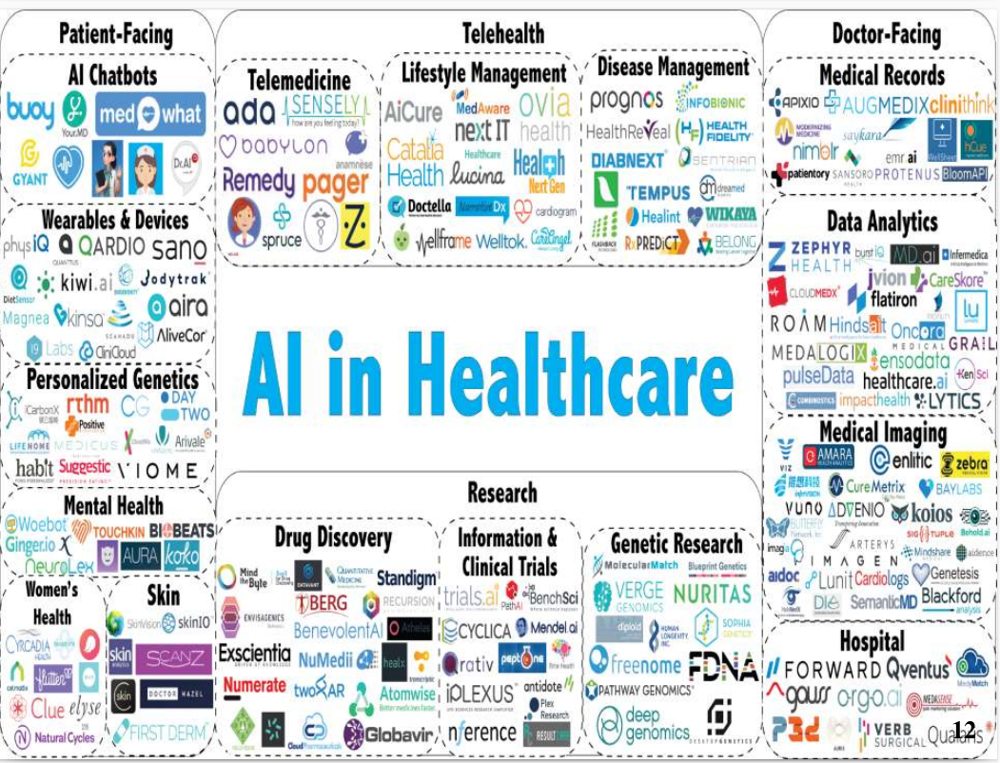
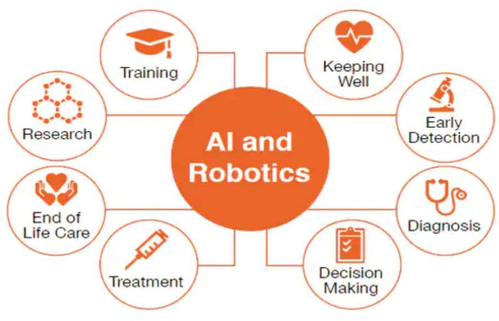
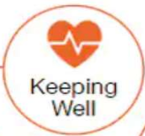
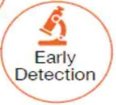

<style type="text/css">
.remark-slide-content {
    font-size: 24px;
    padding: 1em 4em 1em 4em;
}
.left-code {
  color: #777;
  width: 38%;
  height: 92%;
  float: left;
}
.right-plot {
  width: 60%;
  float: right;
  padding-left: 1%;
}
</style>

```{r setup, include=FALSE}
options(htmltools.dir.version = FALSE, echo=FALSE,
        message=FALSE,warning=FALSE,
        fig.dim=c(4.8, 4.5), fig.retina=2, out.width="100%")

knitr::opts_chunk$set(echo = FALSE)

knitr::knit_hooks$set(mysize = function(before, options, envir) {
  if (before) 
    return(options$size)
})
```


# Outline

.columnwide[
  ### 1) [AI is Everywhere, also in Health](#Introduction)
  ### 2) [Data, Health Data, Big Data](#Data)
  ### 3) [Data Science, Machine Learning and AI](#FRomDS2AI)
  ### 4) [Challenges and Limitations](#AIExamples)
  ### 5) [Not to talk about Ethics](#Ethics)
  ### 6) [Summary](#Summary)
]

---

class: inverse, middle, center

name: Introduction

# Artificial Intelligence Everywhere, also in Health

---

# AI : Everyone talks about it

 

---

# AI : Everyone talks about it

- AI is a broad term that refers to _any technology that enables a machine to perform tasks that would typically require human intelligence_, such as __learning__, __problem-solving__, and __decision-making__. 

- AI is present in many different technologies and applications that we use every day, such as smartphones, social media, and personal assistants like Siri and Alexa. 
- As a result, AI has become *an integral part of our daily lives*, and it is increasingly being used in a wide range of industries and applications. 

<!-- - This is why we can argue that AI is "everywhere" – it is present in many different aspects of our daily lives, and it is continuing to grow and expand. -->
---
# Examples of AI in everyday life

- __Smartphone personal assistants__, Siri and Google Assistant.
- __Social media algorithms__,  to recommend content and customize user experiences.
- __Virtual assistants__, Amazon's Alexa and Apple's HomePod.
- __Autonomous vehicles__, such as self-driving cars, which use AI to navigate roads and make driving decisions.
- __Fraud detection systems__, which use AI to analyze transactions and identify potential fraudulent activity.
- __Customer service chatbots__, which use natural language processing to provide answers to customer inquiries.
- __Healthcare systems__, which use AI to analyze medical images and assist with diagnosis and treatment planning.
- And many other such as: __Online education platforms__, __Video game AI__ or __Recommender Systems__.

---

# AI in Health care


---

# AI will (mostly) help, not replace

.left-column[
<br>
.center[ 
 
 ]
]
.right-column[
- A common concern is _Will AI replace humans?_
- AI advocates don't think so, instead they talk of _complement_, _enhance_, support... 
- This concern also exists in medicine
  - Some AI experts claim that in 3-5 years radiologist will not be necessary anymore.
- Dr. Eric Topol in his book Deep Medicine:
  - Introducing AI in Healthcare is good
  - It lets the machine do the machine work
      - Fill forms, Scan images
    - With more efficiency and new workflows.
  - And the doctor has more time for patients.
]
---
# AI is not  future, it is here now

.center[ 
 
 ]

---

# AI end well being

.left-column[
<br>
.center[ 
 

 
  ]
]
.right-column[
- AI powered monitoring gadgets, such as bracelets, smart watches and many other   have become common.
- Some, such as the Apple Watch allow for continuous heart-rate monitoring and are inteded to detect potential CV incidents.
- Many potential benefits: 
  - Motivation for exercise
  - Real time data for detection / prevention
- But not free from problems
  - Lack of standarization and credibility
  - Potential data protection issues when sahring data
]
---

# AI in Health for early detection

.left-column[
<br>
.center[ 
 

 ]
]
.right-column[
- AI, particularly through image analysis with deep learning, is being used to detect diseases, such as cancer, more accurately in early stages.
- Automatic detection can be faster and highly accurate, but _beware of biases and overfitting_ 
- It can reduce false positives and unnecessary expensive/dangerous tests s.a. biopsies.
- Not free from problems
  - Gender or race biases exist
  - Somee tumours that would never progress arre included causing unnecessary alert
  
[Can Artificial Intelligence Help See Cancer in New, and Better, Ways?](https://www.cancer.gov/news-events/cancer-currents-blog/2022/artificial-intelligence-cancer-imaging)
]

---

# AI for Diagnosis and Prognosis 

.left-column[
<br>
.center[ 
 

  ]
]
.right-column[
- Machine learning algorithms are being used in many fileds for classification (diagnosis) and prediction (prognosis).
- Some may work like black-boxes (less intuitive than some statistical models), 
- Under the appropriate circumstances, enough data, and _correctly used_ may be very accurate.
- Typical scenario is analysis of medical imaging data or real time monitoring signals.

[Dermatologist-level classification of skin cancer with deep neural networks](https://www.nature.com/articles/nature21056)
]
---

# AI for Treatment design

.left-column[
<br>
.center[ 
 

  ]
]
.right-column[
- AI empowered systems may be used to analyze EHR, Images and reports from a patient’s history to help select the correct, individually
customized treatment path.  
- Data availability, combined with AI tools allows shifting from:
  - _Treatments for populations_ where medical decisions are taken based on a few similar physical characteristics among patients, to
  - _Preventive, Personalized, Precision_ medicine to provide the specific treatment for a specific patient]
  
  [Precision Medicine, AI, and the Future of Personalized Health Care
](https://www.ncbi.nlm.nih.gov/pmc/articles/PMC7877825/)


---
class: inverse, middle, center

name: Data

# Data, Health Data and Big Data

---
# The players of healthcare

.center[ 
 
]

---

# The health data life cycle

.center[ 
 
]

## Health data types

.pull-left[
- Electronic health records
- Medical claims
- Clinical notes
- Medical literature
- Continuous signals
]
.pull-right[
- Imaging data
- Medical ontology
- Clinical trial data
- Drug discovery data
]
---
#  Electronic Health Records (EHR)


.center[ 
 
]

---

# The EHR workflow


.center[ 
 
]
---

# Longitudinal EHR data

.center[
 
]

---

# Properties of EHR 

<br>
.center[
 
]

- Electronic Health Records are the main source of information in Health Care
- While potentially very useful its variety hinders the possibilities of a faster and more powerul profitability.

---

# Health Care Data is Big

<br>
.center[
 
]

---


class: inverse, middle, center

name: FRomDS2AI

# Data Science, Machine Learning and Artifiical Intelligence

---
# Data Science, Machine Learning and Artificial Intelligence

.center[
 
]

---

# Machine Learning and Artificial Intelligence

.center[
 
]

---

# Artificial Intelligence (s)

.center[
 
]

---

class: inverse, middle, center

name: Ethics

# Not to talk about Ethics

---
# Not to talk about Ethics

---

class: inverse, middle, center

name: summary

# Summary

---
# Summary

---

class: inverse, middle, center

name: Resources

# References and Resources

---
# References and Resources
